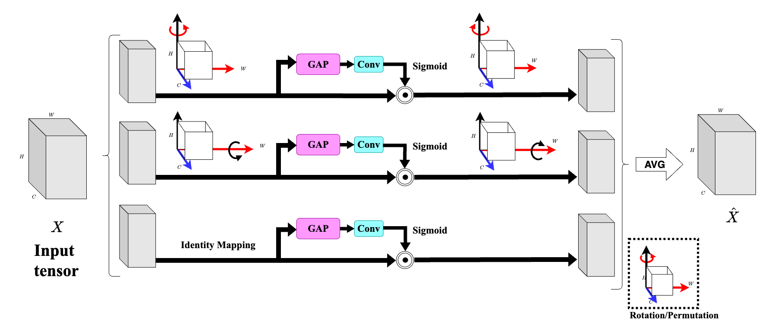

# STARC 🚀

Official repository for "STARC: A generalisable Self-Supervised Triple Attention Network for Coronary Vessel Segmentation".

## Overview 💡

<div align="center">
  
  <p>STARC Framework Overview</p>
</div>

<div align="center">
  
  <p>Revolving Attention Block (RAB)</p>
</div>


## Abstract 📝

Medical image segmentation can potentially alleviate radiologists’ workload by accurately estimating stenosis severity. We introduce **STARC**, a self-supervised Coronary Angiography network that utilizes a Triple Attention encoder to enhance multi-scale feature representation learning for vessel segmentation. The proposed encoder uses parallel convolutions with diverse kernel sizes to generate dynamic channel-wise attention weights, enabling efficient extraction of fine-grained structural information across scales. This design supports the segmentation of thin and elongated structures, such as vessels, while maintaining low model complexity and high stability during training. Unlike prior self-supervised approaches relying on diffusion models or adversarial learning—which often introduce training instability and computational overhead—STARC provides a streamlined architecture with consistent convergence. The training objective integrates L1, clDICE, and BCE losses to simultaneously optimize region accuracy and boundary precision. We validate STARC on a diverse set of datasets, including unseen coronary angiograms (134XCA, and 30XCA) and retinal vessel images (DRIVE, and STARE), demonstrating strong generalization across imaging domains. Results show that our architecture outperforms several recent self-supervised and is at par with supervised baselines in terms of segmentation accuracy and robustness, supported with their class attribution maps (CAM) for explainability. STARC offers a practical, domain-agnostic solution for structure segmentation tasks, with potential applications in medical image analysis.

## Platform and Environment⚙️

*   **OS**: Ubuntu 🐧
*   **Python**: >= 3.9 🐍
*   **PyTorch**: >= 1.12.1 🔥

## Setup 🛠️


Create a conda environment:

```bash
conda create -n starc python=3.9
conda activate starc
pip install -r requirements.txt
```

## Data Resources 💾

Datasets used in our experiments:

*   **XCAD**: [[Link](https://www.dropbox.com/scl/fi/mvstwdgxo0hfk678x94d4/XCAD.zip?rlkey=qdztml0gzfzoc0t5d16k71u76&e=1&dl=0)]
*   **DRIVE**: [[Link](https://www.kaggle.com/datasets/andrewmvd/drive-digital-retinal-images-for-vessel-extraction)]
*   **CHASEDB1**: [[Link](https://www.kaggle.com/datasets/khoongweihao/chasedb1)]
*   **30 XCA**: [[Link](https://github.com/Binjie-Qin/SVS-net)]
*   **134 XCA**: [[Link](https://www.mdpi.com/2076-3417/9/24/5507)]

## Training 🚀

```bash
python3 main.py -p train -c config/train.json
```

## Testing 🧪

```bash
python3 main.py -p test -c config/test.json
```

## Pre-trained Models 🧠


Pre-trained models for evaluation will be available soon!


## 🤝Citation
<!-- ```
 @article{your_citation,
  title={STARC: A generalisable Self-Supervised Triple Attention Network for Coronary Vessel Segmentation},
  author={Author, A. and Author, B.},
  journal={Journal Name},
  year={2025}
} 
``` -->

## Thankful
We acknowledge the use of code from:

*   **NVIDIA SPADE**: [[GitHub](https://github.com/NVlabs/SPADE)]
*   **SSVS (SJTU Shanghai)**: [[GitHub](https://github.com/AISIGSJTU/SSVS)]
*   **C-DARL (Boah Kim)**: [[GitHub](https://github.com/boahK/MEDIA_CDARL/tree/main)]

We appreciate their contributions to open source.